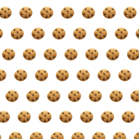
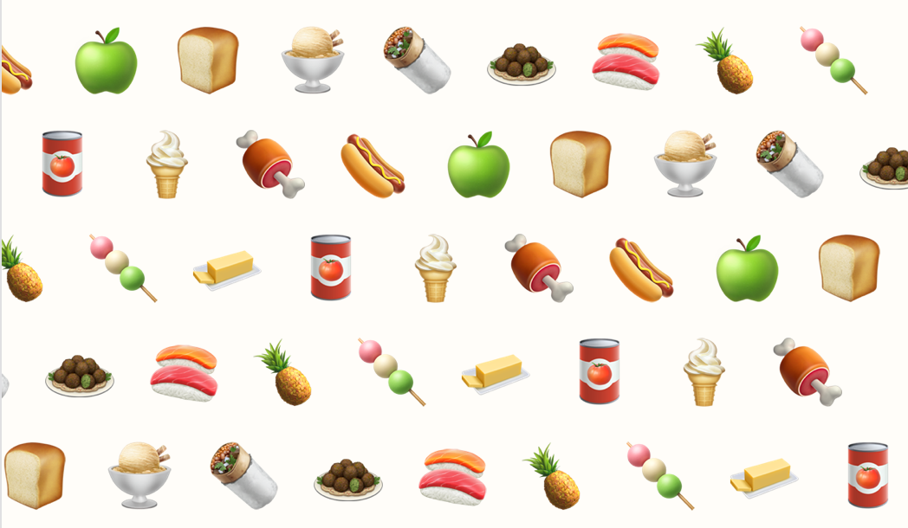

# 🥑 Unicode Patterns

Generate patterns from unicode characters (probably emojis 😁).

## Example

You can generate a canvas, an image (base64) or apply a background to an element. For the latter:

```js
applyUnicodeBackground(element, ["🍪"]);
```



You can include as many characters as you want and many options to customize the behaviour.



## Demo

`index.html` is a demo. You can try it online at <https://zheoni.github.io/unicode-patterns/>

## Functions

- `chars` is a array of strings (of characters).
- `options` is an object whose properties are described below.

### Generate canvas

```js
function generateUnicodeCanvas(chars, options, canvas)
```

Generates a canvas with the pattern. If canvas is given uses that canvas instead of creating a new one.

### Generate image

```js
function generateUnicodeImage(chars, options)
```

Generates a base64 image with the pattern.

### Apply background

```js
function applyUnicodeBackground(element, chars, options)
```

Element is an element from the DOM.

## Options

All measurements are in pixels.

- `width` and `height`: Width and height of the pattern. No effect if applying a background. If canvas given while generating canvas, changes the size.
- `initialx` and `initialy`: Starting offsets of the pattern.
- `sepx` and `sepy`: Separation between characters.
- `offsetx` and `offsety`: Offsets applied for each row or column. (*probably you only want to use one at a time while keeping the other one at 0*)
- `fontSize`: Size of the characters.
- `backgroundColor`: Color of the background, a valid CSS color.
- `fontColor`: Color of the characters (dont affect emojis), a valid CSS color.
- `random`: If true, characters picked at random from chars; if false, picked in the same order as given.

These are the default values:

```js
{
  width: 400,
  height: 400,
  initialx: 0,
  initialy: 0,
  sepx: 20,
  sepy: 20,
  offsetx: 25,
  offsety: 0,
  fontSize: 40,
  fontFamily: "sans-serif",
  backgroundColor: null,
  fontColor: null,
  random: false
}
```
